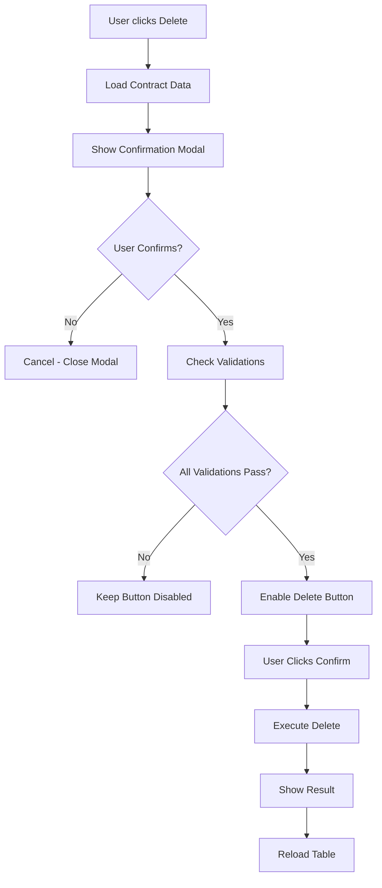

# Delete Confirmation Enhancement - OptimaPro

## 📋 Overview
Enhanced delete confirmation system untuk mencegah penghapusan kontrak secara tidak sengaja dengan double confirmation mechanism.

## 🔧 Features Implemented

### 1. **Double Confirmation System**
- **First Level:** User clicks delete button
- **Second Level:** Custom modal dengan multiple validation steps

### 2. **Validation Requirements**
User harus memenuhi semua kondisi berikut:
- ✅ **Checkbox Confirmation:** Centang "Saya memahami konsekuensi..."
- ✅ **Text Verification:** Ketik "HAPUS KONTRAK" dengan benar
- ✅ **Contract Data Review:** Review data kontrak yang akan dihapus

### 3. **Safety Features**
- **Contract Data Display:** Menampilkan detail kontrak sebelum hapus
- **Impact Warning:** Informasi dampak penghapusan yang jelas
- **Disabled State:** Button delete disabled sampai semua kondisi terpenuhi
- **Auto-cleanup:** Modal otomatis dihapus setelah ditutup

## 🎨 UI/UX Enhancements

### Modal Design
```
┌─────────────────────────────────────────┐
│ ⚠️ Konfirmasi Hapus Kontrak            │ ← Danger Header
├─────────────────────────────────────────┤
│ ⚠️ PERINGATAN: Tidak dapat dibatalkan!  │ ← Warning Alert
│                                         │
│ Data Kontrak:                          │ ← Contract Info
│ ┌─────────────────────────────────────┐ │
│ │ No. Kontrak: KTR-001               │ │
│ │ Pelanggan: PT ABC                  │ │
│ │ Status: Aktif                      │ │
│ │ Nilai: Rp 100,000,000             │ │
│ └─────────────────────────────────────┘ │
│                                         │
│ Dampak Penghapusan:                    │ ← Impact Warning
│ • Kontrak dihapus permanen             │
│ • Data spesifikasi ikut terhapus       │
│ • Riwayat transaksi terpengaruh        │
│ • Data tidak dapat dipulihkan          │
│                                         │
│ ☑️ Saya memahami konsekuensi...         │ ← Checkbox
│                                         │
│ Ketik "HAPUS KONTRAK":                 │ ← Text Input
│ [________________]                      │
│                                         │
│         [Batal]  [Ya, Hapus Kontrak]   │ ← Action Buttons
└─────────────────────────────────────────┘
```

### Color Scheme
- **Primary:** `#dc3545` (Bootstrap Danger Red)
- **Warning:** `#ffc107` (Bootstrap Warning Yellow)  
- **Background:** `#f8f9fa` (Light Gray)
- **Text:** `#212529` (Dark Gray)

## 🔄 Process Flow



## 🛡️ Security Features

### CSRF Protection
```javascript
data: { '<?= csrf_token() ?>': '<?= csrf_hash() ?>' }
```

### Input Validation
- Contract ID validation
- Exact text matching ("HAPUS KONTRAK")
- Checkbox confirmation required
- Server-side validation in controller

### Error Handling
- Network timeout (30 seconds)
- Server error handling (404, 500, etc.)
- User-friendly error messages
- Button state management

## 📱 Responsive Design
- Mobile-friendly modal design
- Touch-optimized buttons
- Readable typography on all devices
- Proper spacing and padding

## 🧪 Testing Scenarios

### Happy Path
1. Click delete button
2. Review contract data
3. Check confirmation checkbox
4. Type "HAPUS KONTRAK"
5. Click "Ya, Hapus Kontrak"
6. Verify success message
7. Verify table reload

### Error Handling
1. Invalid contract ID
2. Network errors
3. Server errors (404, 500)
4. Timeout scenarios
5. Invalid CSRF token

### User Experience
1. Cancel operations
2. Modal keyboard navigation
3. Focus management
4. Loading states
5. Success/error feedback

## 📊 Benefits

### Security
- ✅ Prevents accidental deletions
- ✅ Multiple validation layers
- ✅ Clear warning messages
- ✅ CSRF protection

### User Experience  
- ✅ Clear visual feedback
- ✅ Informative error messages
- ✅ Loading states
- ✅ Responsive design

### Maintainability
- ✅ Modular JavaScript functions
- ✅ Proper error handling
- ✅ Clean code structure
- ✅ Easy to extend

## 🔧 Usage Example

```javascript
// Trigger delete confirmation
deleteContract(contractId);

// This will:
// 1. Load contract data
// 2. Show confirmation modal
// 3. Validate user input
// 4. Execute delete if confirmed
```

## 📝 Notes
- Modal auto-cleanup prevents memory leaks
- Button state management ensures UX consistency  
- Comprehensive error handling covers edge cases
- JSON relations logging implemented in backend
